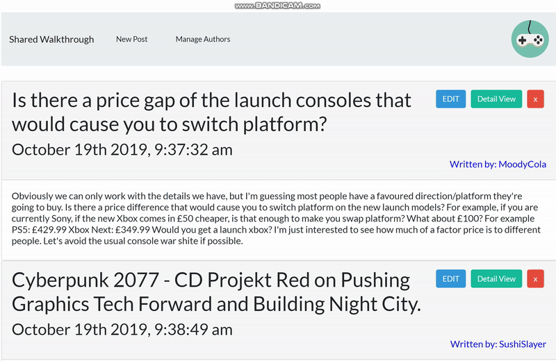

### Acknowledgments

* This web-application is still under continuing development! See below for anticipated release date.
* For further development details see [further development plan](furtherDevPlan.md)
---------------------------------------------

# Walkthrough_Blog

A forum/platform that users can share their strategies and walkthroughs for those who suffering from getting through sections/stages of their favorite game.

## Description

Basically, this website is a blog that many of users can share their thoughts about their favorite games. There are number of different topics that user can choose at the time when they are posting their contents. For instance, if user wants to sahre information about the release date of their favorite video game, they can post it under "Upcoming Games" section. On the other hand, if user wants to get a help about unbeatable boss they are facing, they can request for help under the "Help Requested" section. Furthermore, users can discuss about their favorite games with fellow fan-boy gamers in a separate board upon request to the administrator.

In general, this blog would be somewhat similar to the generic Q/A forum available on the internet such as `Quora`.

## Deployed Page:
https://enigmatic-ocean-98245.herokuapp.com/

## Use Example:

### 

## Screen Captures:

* Home page - showing each post stored in the database
  

---------------------------------------------------------------------------------------

## Getting Started

### Dependencies

* best viewed laptop or desktop

### Installing

* none necessary - use browser to view

<!-- ### Executing program -->

## Authors

* Hyeong Suk Kim - hyeongsukkim94@gmail.com

## Version History

* Listed Anticipated Release date:
    - [x] 0.1

<!-- ## License -->

## Techonologies Used

* Node and Express Web Server
* MySQL Database 
* GET and POST routes for retrieving and adding new data
* Be deployed using Heroku (with Data)
* Following MVC paradigm

